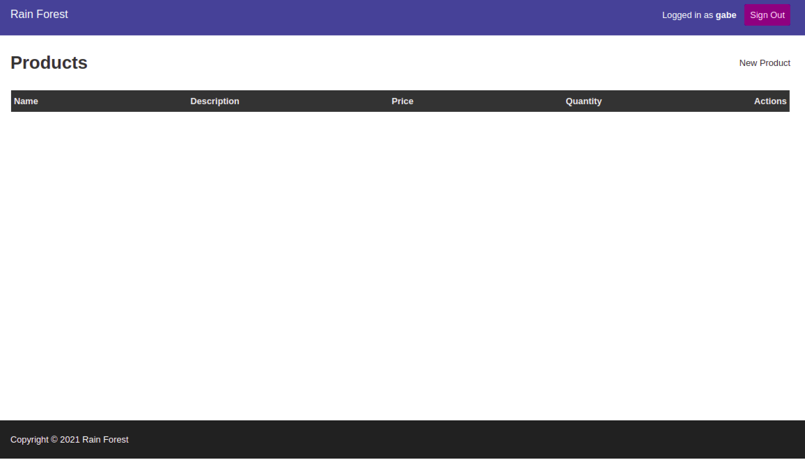
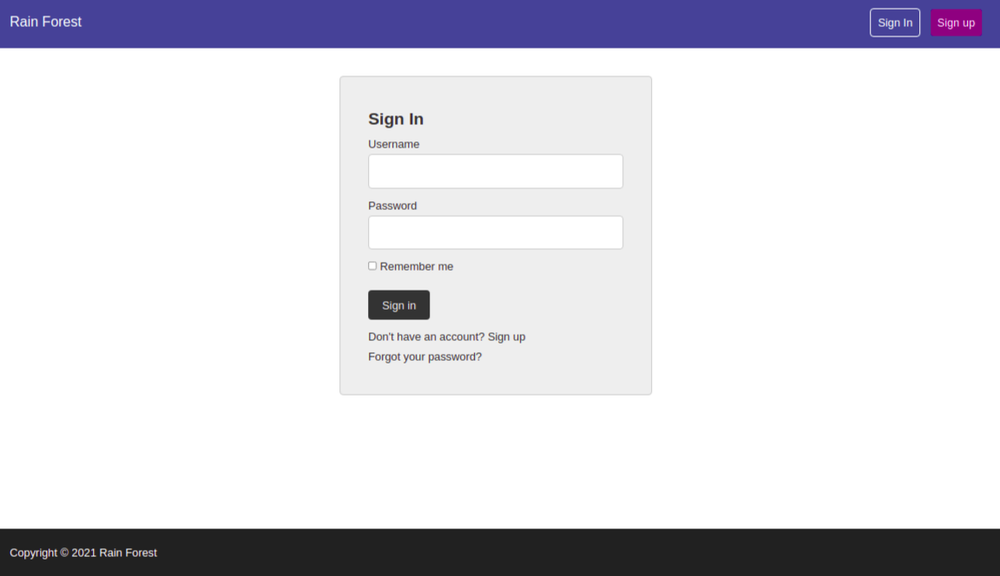
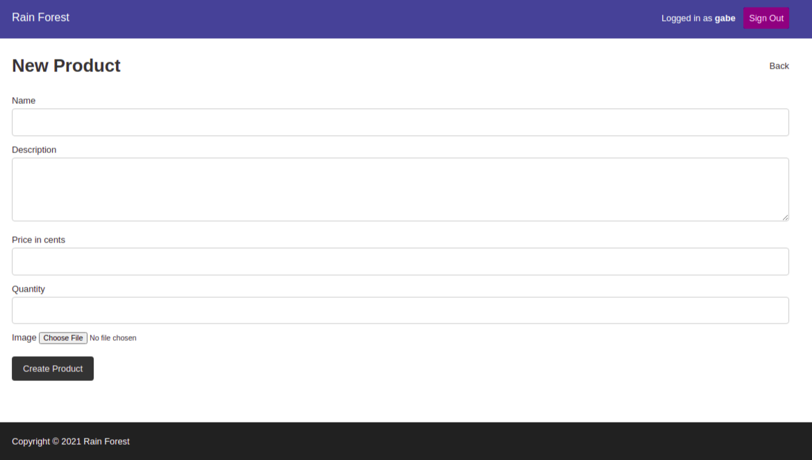
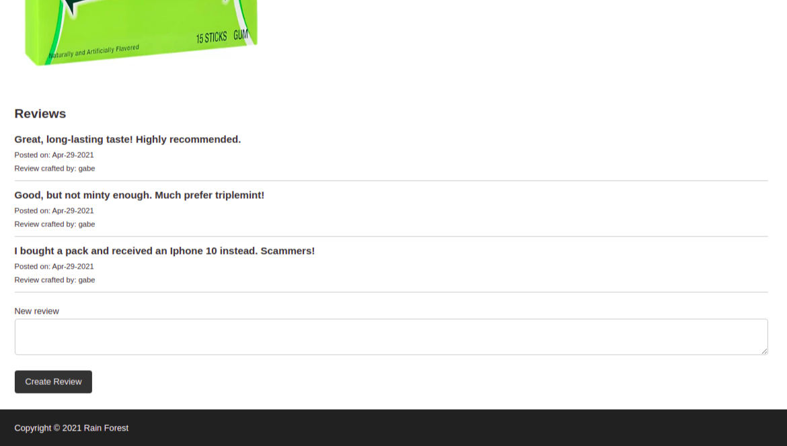
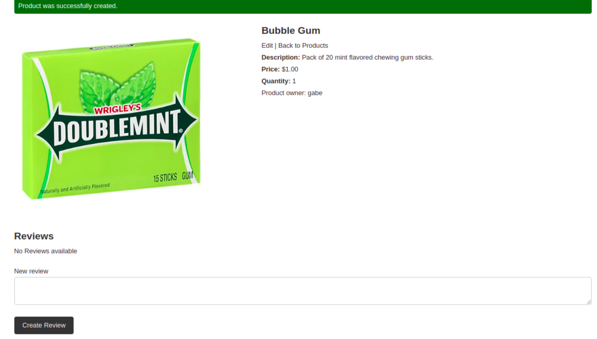
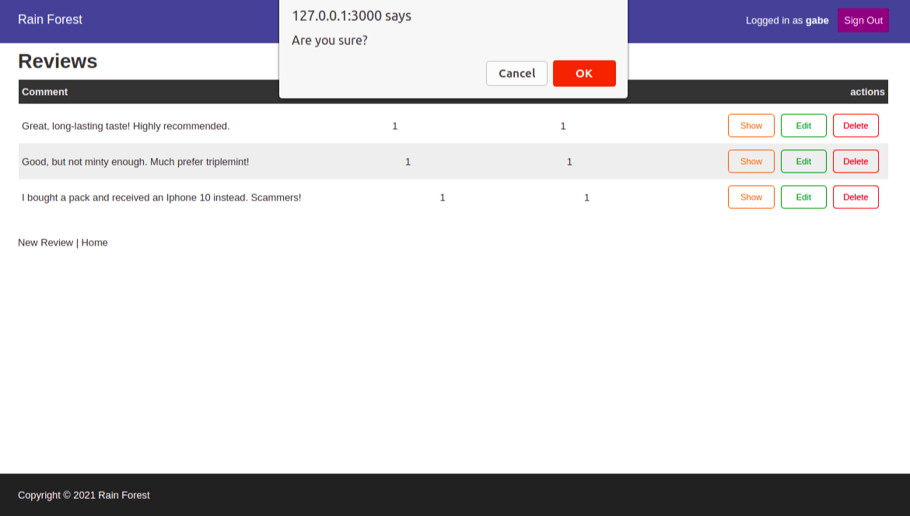

# Rainforest
Rainforest is a marketplace site, similar to Amazon, that allows users to list/remove products for sale and post/delete reviews.



It includes user authentication.



Posted products must have a name, description, price, and quantity. There is also an option to add an image.



Products are displayed along with their reviews.



New reviews can be added from the same page.



Deleting products or reviews requires confirmation.



## Installation
This site was created using Ruby on Rails on Ruby version 2.7.1.

Prerequisites to use are a terminal and a similar version of Ruby installed.

From the terminal,
```bash
git clone github.com/ValerieChiquinquira/rainforest-practice
cd rainforest-practice
bundle install
rails db:create:all
rails db:migrate
rails s
```
And enjoy!

## Usage
Create a user by clicking sign up on the top right corner of the home page.

Then, play around creating new products and reviews, as well as editing and deleting them.